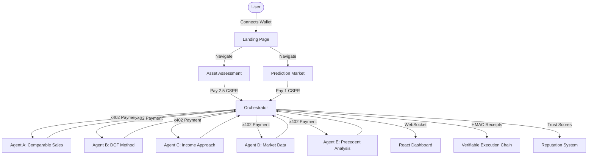

# Casper RWA Court ⚖️

An autonomous, multi-agent dispute resolution system for Real World Assets (RWA) built on the Casper Network.

## Architecture



## Features

### Landing Page
- Premium dark theme with canvas particle effects
- Animated gradient orbs and cursor glow
- ScrambleText hero headline (cryptographic text effect)
- Live assessment visual showing 5-step valuation process
- Sticky scroll section with horizontal navigation
- Responsive top-nav layout (separate from app sidebar)

### Asset Assessment (`/assess`)
- 5 AI agents analyze assets using different methodologies
- Multi-methodology dashboard with divergence range
- Risk flags panel (high/medium/low)
- Consensus analysis with agreement level
- Real-time WebSocket updates during deliberation

### Prediction Market (`/predict`)
- Probability cards from 5 agents
- Weighted consensus calculation
- Risk factors panel
- Timeframe selector (1-24 months)

### Agent Reputation (`/reputation`)
- On-chain reputation scores
- Score history sparklines
- Tier assignment: Platinum, Gold, Silver, Bronze
- Accordion tabs with detailed agent info

### Dashboard (`/dashboard`)
- Live contract state (disputes, receipts, staked CSPR)
- x402 payment stream visualization
- Auto-refresh every 30 seconds

## Technology Stack

- **Frontend:** React 19 + Vite + Tailwind CSS v3
- **Animations:** GSAP + @gsap/react + use-scramble + motion
- **Blockchain:** Casper Testnet + casper-js-sdk v5
- **Smart Contracts:** Odra 2.8.1 (Rust → WASM)
- **Payments:** x402 HTTP Micropayment Standard (real on-chain signing)
- **Wallet:** Casper Wallet Chrome Extension (window.CasperWalletProvider)
- **Backend:** Node.js 20 + TypeScript + MCP SDK v1.16.0
- **Testing:** Vitest (27/27 tests passing)

## Routes

| Route | Layout | Description |
|-------|--------|-------------|
| `/` | LandingLayout (top-nav) | Premium landing page |
| `/dashboard` | Layout (sidebar) | Live contract state |
| `/assess` | Layout (sidebar) | Asset valuation (2.5 CSPR) |
| `/predict` | Layout (sidebar) | Prediction market (1 CSPR) |
| `/reputation` | Layout (sidebar) | Agent reputation |
| `/transactions` | Layout (sidebar) | Transaction history |
| `/architecture` | Layout (sidebar) | How it works |
| `/roadmap` | Layout (sidebar) | Product roadmap |

## Smart Contracts (Deployed on Casper Testnet)

- **VotingContract:** [`f00cbb8f...`](https://testnet.cspr.live/deploy/f00cbb8f03e468c0750e7ce78bfc7f8a5c337fd520ebc218e969833bdea0fcfb)
- **EscrowContract:** [`83bf2bab...`](https://testnet.cspr.live/deploy/83bf2bab33200e60b092847abc38ea5d0301327fae43fc2d3555fec5be120d3a)
- **ReputationRegistry:** [`30da84e6...`](https://testnet.cspr.live/deploy/30da84e6d0db566b5d8ba4a93cc392bd2268bff6c24c1c0e5cb16a4f51038942)

## Wallet Integration

- Uses official Casper Wallet SDK (injected by Chrome extension)
- `window.CasperWalletProvider` — factory function
- Events via `window.addEventListener(CasperWalletEventTypes.Connected, handler)`
- Payment flow: signPayment() creates native CSPR transfer → wallet signs → returns proof
- Platform wallet: `02039cd256da1f2e13fc24a6f2ad1c15166f45070befa52bc2da46bbe194e7381010`

## Key Constants

- Assessment fee: 2.5 CSPR
- Prediction fee: 1 CSPR
- Filing fee: 0.1 CSPR
- Juror payment: 0.03 CSPR per juror
- Divergence threshold: 25% (triggers dispute)
- Min juror reputation: 600/1000

## Running the Project

```bash
# Install dependencies
cd dashboard && npm install
cd ../agents && npm install

# Start dashboard
cd dashboard && npm run dev

# Start agents (in separate terminal)
cd agents && npm run dev
```

Navigate to `http://localhost:5173` to see the landing page and connect your Casper Wallet.

## Testing

```bash
cd agents && npm test
# 27/27 tests passing
```

## Project Structure

```
casper-rwa-court/
├── contracts/           # Odra smart contracts (Rust)
│   ├── reputation/      # ReputationRegistry
│   ├── escrow/          # EscrowContract
│   └── voting/          # VotingContract
├── agents/              # Backend services (TypeScript)
│   └── src/
│       ├── index.ts     # Orchestrator
│       ├── analyst.ts   # AI analyst agents
│       ├── hmac-chain.ts
│       ├── trust-scoring.ts
│       └── x402-middleware.ts
├── dashboard/           # React 19 frontend
│   └── src/
│       ├── pages/       # LandingPage, DashboardView, AssessView, etc.
│       ├── layouts/     # LandingLayout (top-nav), Layout (sidebar)
│       ├── contexts/    # CSPRClickContext (wallet provider)
│       └── components/  # UI components
├── scripts/             # Deploy and demo scripts
├── CLAUDE.md            # AI onboarding document
├── ARCHITECTURE.md      # Master architecture
└── README.md            # This file
```
