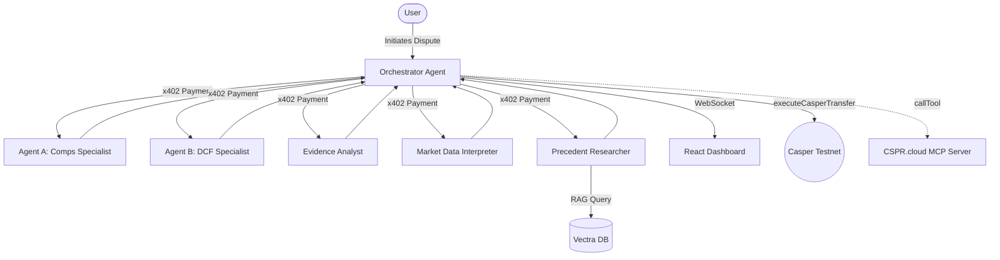

# Casper RWA Court ⚖️

An autonomous, multi-agent dispute resolution system for Real World Assets (RWA) built on the Casper Network.

This project implements the [Casper AI Toolkit](https://www.casper.network/ai) and demonstrates:
- **x402 Micropayments**: Agents pay each other in CSPR per API request.
- **Model Context Protocol (MCP)**: Native integration with CSPR.cloud for querying balances and the latest blocks.
- **Upgradable Smart Contracts (Odra)**: Deploys `VotingContract`, `EscrowContract`, and `ReputationRegistry`.
- **RAG & Agent Memory**: Employs `vectra` to retrieve historical dispute precedents.

## Architecture



## Running the Project

1. Run all agents and the orchestrator:
   ```bash
   cd agents
   npm run test-agents
   ```

2. Start the Real-time Dashboard:
   ```bash
   cd dashboard
   npm run dev
   ```

Navigate to `http://localhost:5173` to watch the agents deliberate and settle the dispute on the Casper blockchain.
